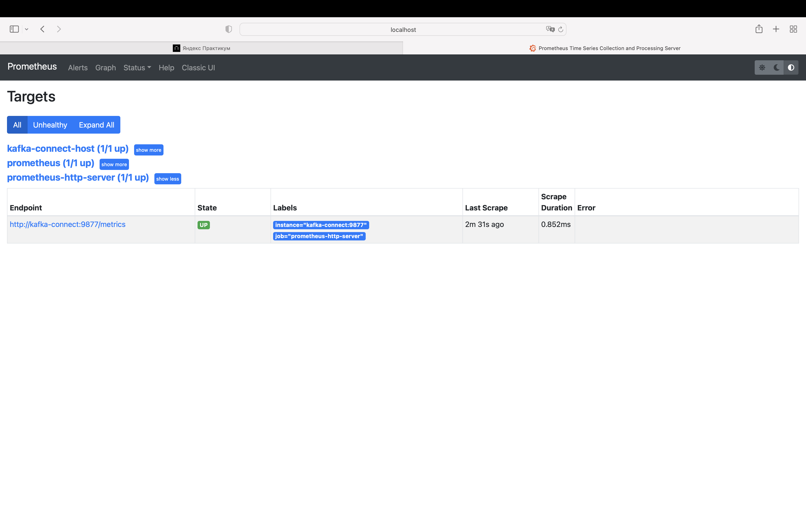
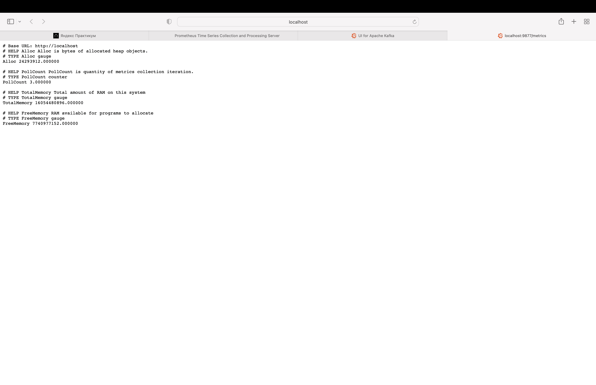

# Apache Kafka для разработки и архитектуры

### Модуль 3
Проектная работа по теме Kafka Connect - работа с коннекторами для интеграции данных с Kafka.
### Задача 2
Создание собственного коннектора для переноса данных из Apache Kafka в Prometheus.

### Описание задачи
Разработать собственный коннектор для извлечения данных из Kafka и их представления в формате, понятном Prometheus.

### Настройка и запуск

1. Собрать проект ```mvn clean install``` (в директории confluent-hub-components появился sink-connector-1.0.
   0-SNAPSHOT.jar)
2. Запуск окружения ```docker-compose up -d```
3. Настройка коннектора:
+ [команда для настройки коннектора](add-connector)
+ [команда для проверки статуса коннектора](get-status)
+ [команда для получения настроек коннектора](get-config)

5. Проверить статус job="prometheus-http-server" http://localhost:9090/targets
   

6. При помощи UI выполнить отправку в топик ```metrics-topic``` сообщения:
+ [тестовые данные](test-data)

7. Проверить, что метрики отображаются по адресу http://localhost:9877/metrics

8. Выполнить запрос к АПИ prometheus и проверить, что метрики и их значения возвращаются корректно
+ [команда для запроса метрик](get-metrics)


